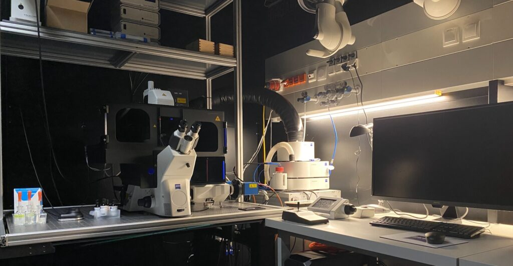
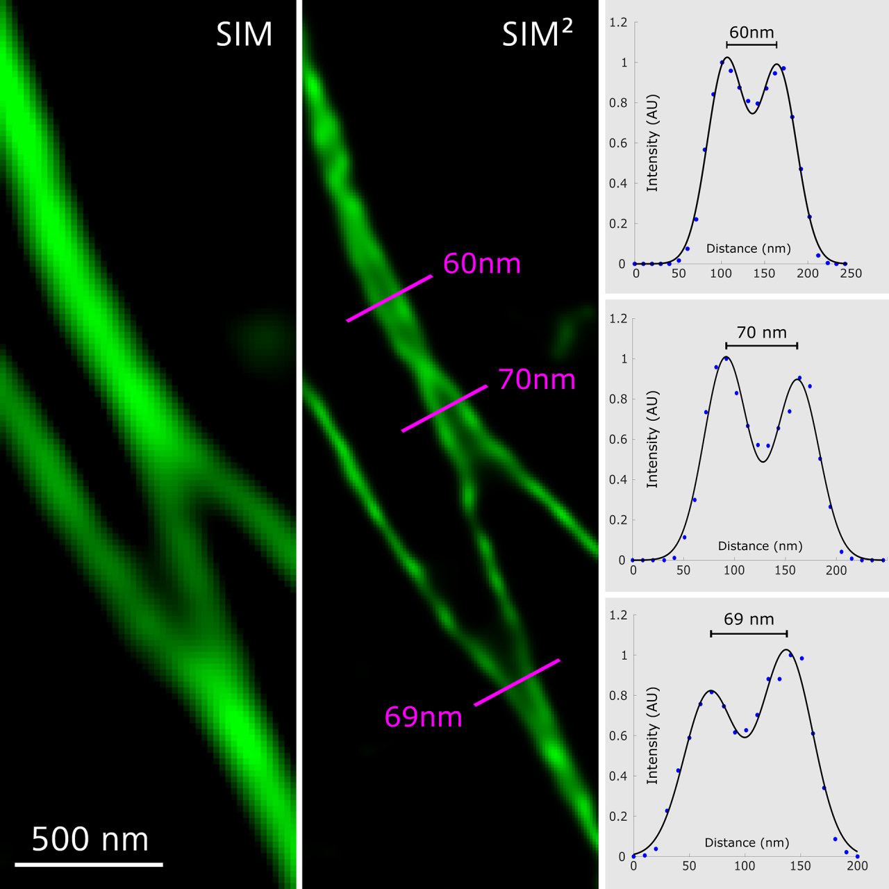

# Notes du 12/08/25 : La méthode Lattice di-SIM

> 
> *Système Zeiss Elyra 7 équipé pour la Lattice SIM² (source : [ista](https://iof.pages.ist.ac.at/equipment/zeiss-elyra-7/))*

## La méthode Lattice di-SIM

La méthode **Lattice di-SIM (SIM²)** est une évolution de la microscopie à illumination structurée 3D (3D-SIM), implémentée notamment sur le système **Zeiss Elyra 7**. Elle combine une illumination spécialisée et une reconstruction algorithmique avancée pour dépasser les limites de la super-résolution optique classique.

---

## Détail du procédé de SIM²

### Principe de la SIM classique

La SIM (Structured Illumination Microscopy) utilise un motif de lumière structuré (bandes sinusoïdales) projeté sur l’échantillon. Cela transfère l’information spatiale haute fréquence dans la plage détectable par l’objectif, puis des algorithmes recombinent plusieurs images acquises pour obtenir une **résolution latérale doublée** (~100-120 nm).

---

### Lattice SIM

En Lattice SIM, au lieu de motifs "grille", on utilise un pattern « treillis » (lattice) qui permet une illumination **plus douce et efficace** : idéal pour les échantillons vivants et fragiles, car le besoin en photons est réduit. 

> *Comparaison des motifs d'illumination : SIM classique (gauche), Lattice SIM (droite). Source : Zeiss*
> *source: [Zeiss](https://www.zeiss.com/microscopy/en/products/light-microscopes/super-resolution-microscopes/elyra-7.html)*

---

### Lattice SIM² (SIM2)

- **Reconstruction en deux étapes :** 
    - 1re étape : combinaison des ordres de diffraction, suppression du bruit, génération d’une **fonction d’étalement du point (PSF)** numérique spécifique à l’appareil.
    - 2e étape : reconstitution des structures fines, avec suppression supplémentaire du bruit et filtrage numérique.
- **Résultats :** 
    - Résolution latérale jusqu’à **60 nm**
    - Résolution axiale ~**200 nm**
    - Section optique améliorée (meilleur Z)
    - Compatibilité avec la plupart des modes avancés du système Elyra 7 (SIM, Lattice SIM, Apotome, Leap Mode, SMLM, TIRF, etc.).

---

## Avantages pour la biologie cellulaire

- **Vitesse d’acquisition élevée** : jusqu’à 255 images/seconde.
- **Phototoxicité minimale** : idéal pour l’imagerie de cellules vivantes à long terme.
- **3D profond** : jusqu’à ~70μm d’épaisseur (vs ~20μm pour la SIM classique).
- **Facilité d’utilisation** : compatible avec les marquages et protocoles standards de bioimagerie.

---

## Déploiement sur le Zeiss Elyra 7

- Plateforme **multi-modale**, contrôlable par logiciel intégralement.
- Reconstructions avancées SIM² & corrections optiques adaptatives.
- Maximum de qualité d’image, quelles que soient les variations de l’indice de réfraction.

---

## Points clés à retenir

Lattice di-SIM (SIM²) sur l’Elyra 7 :
- **Super-résolution 3D, rapide et douce**
- Résolutions proches de la nanoscopie (~60nm latéral)
- Parfaitement adaptée aux conditions physiologiques et à la biologie du vivant.

---

## Références illustrées et sélectionnées

1. [Présentation technique Zeiss Elyra 7 et Lattice SIM² (IST Austria)](https://iof.pages.ist.ac.at/equipment/zeiss-elyra-7/)
2. [Review PMC : Advances in Structured Illumination Microscopy](https://pmc.ncbi.nlm.nih.gov/articles/PMC8713689/)
3. [Description technique Elyra 7 SIM² (CIBR China)](https://imaging.cibr.ac.cn/english.php/Article/productInfo/product_id/394.html)
4. [Article sur les avancées SIM2 et applications (PMC)](https://pmc.ncbi.nlm.nih.gov/articles/PMC10497409/)

---

> 
> *Visualisation en Lattice SIM² : structures subcellulaires à très haute résolution (source : Zeiss)*

---

 